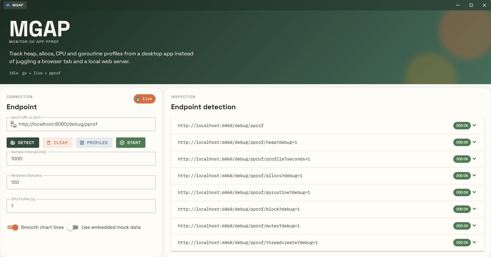
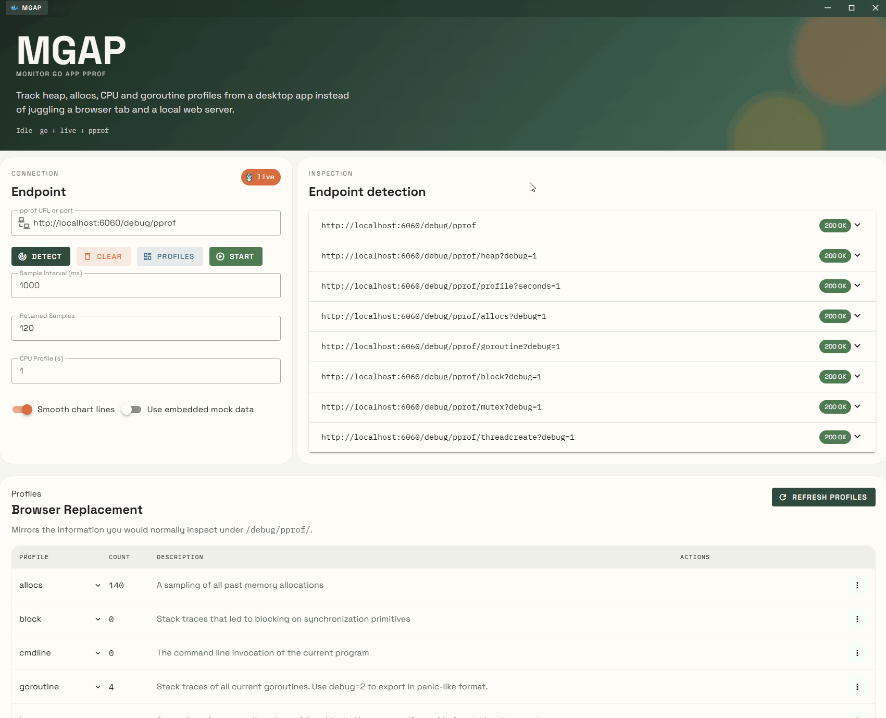

# MGAP - Monitoring Go Application Profiles

[English](README.md) | [简体中文](README_zh.md)

**mgap** (monitor go application profile) is a lightweight desktop pprof monitor built with [Wails](https://wails.io). It fetches, parses, and visualizes Go runtime profiles in real time, so you don't have to juggle browser tabs and local web servers.






---

## Features

- **Live Profile Sampling** — continuously sample heap, CPU, allocs, goroutine, block, mutex, and threadcreate profiles.
- **Auto Endpoint Detection** — just enter a port (e.g. `6060`) or a partial URL and the app discovers `/debug/pprof` endpoints automatically.
- **Real-time Charts** — top-function timelines powered by ECharts, with configurable time ranges and Top-N filtering.
- **Flamegraph View** — interactive flamegraph for quick hotspot analysis.
- **Import / Export** — import existing profile files or export captured snapshots for offline inspection.
- **Raw Text View** — browser-like plain-text profile output when you need the raw numbers.
- **Mock Data Mode** — built-in mock data for UI testing without a live Go process.
- **Frameless Desktop Shell** — custom title bar with drag-to-move, edge-snap maximize / half-screen layout, minimize, and close.
- **Cross Platform** — Windows, macOS, and Linux support via Wails.

---

## Tech Stack

| Layer | Technology |
|---|---|
| Backend | Go 1.23 |
| Desktop Shell | Wails v2 |
| Frontend | Vue 3 + TypeScript |
| UI Components | Vuetify 3 |
| Charts | ECharts + vue-echarts |
| Protocol Buffers | google.golang.org/protobuf |

---

## Quick Start

### Prerequisites

- [Go](https://go.dev/dl/) 1.23+
- [Wails CLI](https://wails.io/docs/gettingstarted/installation) v2.12+
- [Node.js](https://nodejs.org/) 18+

### Run in Development

```bash
wails dev
```

This starts the Go backend and the Vite frontend dev server simultaneously with hot-reload.

### Build

```bash
wails build
```

The packaged executable is generated at:

- **Windows**: `build/bin/mgap.exe`
- **macOS**: `build/bin/mgap.app`
- **Linux**: `build/bin/mgap`

---

## Usage

### 1. Expose pprof endpoints in your Go app

```go
package main

import (
	"log"
	"net/http"
	_ "net/http/pprof"
)

func main() {
	log.Println(http.ListenAndServe("localhost:6060", nil))
}
```

### 2. Open mgap and connect

Enter any of the following in the **Endpoint** input:

```text
6060
localhost:6060
http://localhost:6060/debug/pprof
```

The app normalizes the input and probes the available profiles.

### 3. Start sampling

Click **Start** to begin periodic sampling. Toggle individual metrics on/off, switch between **Flat** and **Cumulative** views, and adjust the **Top N** filter.

---

## Keyboard Shortcuts & Window Behavior

- **Drag title bar** — move the window.
- **Drag to screen top** — maximize.
- **Drag to left / right screen edge** — snap to half-screen.
- **Double-click title bar** — toggle maximize.

---

## Notes

- Profile history is kept in memory and resets when the app restarts.
- Large retained-sample counts can make charts heavier to render.
- This tool is intended for **local development and quick inspection**, not as a replacement for Prometheus / Grafana.

---

## License

MIT
